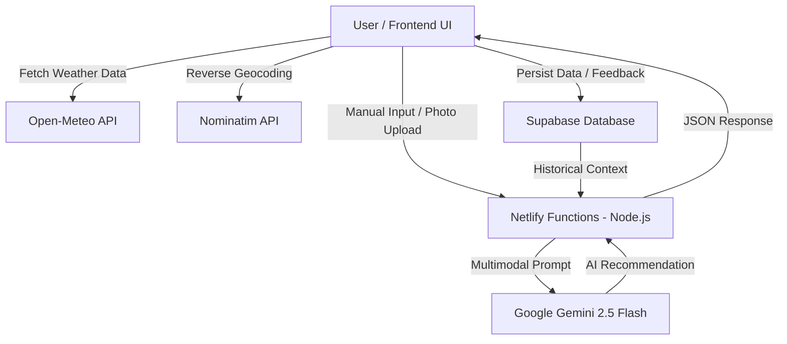

# SmartAura: AI-Driven IoT Environment Intelligence System 🌿✨

**Live Demo:**  
https://fanciful-lollipop-cf1874.netlify.app/

---

# 📌 Project Overview

SmartAura is a sophisticated **Digital Twin IoT Ecosystem** designed to harmonize indoor environments through Artificial Intelligence and real-time data.

Developed for the Internet Programming course, this project simulates IoT sensor nodes (Temperature, Humidity, and Light) without requiring physical hardware. It combines simulated sensor data with external environmental factors such as local weather, geolocation, time, and computer vision analysis.

The main objective is to deliver a personalized wellbeing experience by recommending fragrance blends (essential oils) based on the user's environment and personal preferences stored in a cloud-based historical database.

---

# 🚀 Key Features

- **Digital Twin IoT Simulation**  
  Interactive sliders representing real-time sensor data (Temperature, Humidity, and Lux).

- **Multimodal AI Vision**  
  Integration with Google Gemini 1.5 Flash for analyzing room aesthetics and interior style from uploaded images.

- **Global Context Integration**  
  Real-time weather and geolocation data using Open-Meteo and Nominatim APIs.

- **Intelligent Feedback Loop**  
  Like/Dislike system that enables AI adaptation based on user fragrance preferences.

- **Weekly Predictive Planning**  
  AI-generated fragrance schedules and shopping lists using 7-day weather forecasts.

- **Cloud Persistence**  
  Full Supabase integration for historical logs and preference memory.

---

# 🏗️ System Architecture

The following diagram illustrates the interaction between the frontend, backend, APIs, and AI services:



---

# 🛠️ Tech Stack

## Frontend
- Vanilla JavaScript (ES6+)
- HTML5
- CSS3
- Modern Glassmorphism UI/UX

## Backend
- Node.js
- Netlify Functions (Serverless Architecture)

## AI Engine
- Google Generative AI (Gemini 2.5 Flash)

## Database
- Supabase (PostgreSQL)

## Deployment
- GitHub
- Netlify Continuous Deployment

---

# 📋 Installation & Local Development

## Prerequisites

- Node.js v18 or higher
- Netlify CLI

```bash
npm install -g netlify-cli
```

---

## Setup

### 1. Clone the Repository

```bash
git clone https://github.com/Ang3lhack/Proyectfin.git
cd smartaura
```

### 2. Install Dependencies

```bash
npm install
```

### 3. Configure Environment Variables

Create a `.env` file in the root directory:

```env
GEMINI_API_KEY=your_google_ai_studio_key_here
```

### 4. Run the Development Server

```bash
netlify dev
```

The application will be available at:

```text
http://localhost:8888
```

---

# 📖 User Guide

## 1. Calibrate Sensors

Use the sliders to configure:
- Temperature
- Humidity
- Light intensity

---

## 2. Upload Room Image (Optional)

Upload a room photo so the AI can analyze:
- Furniture style
- Color palette
- Environmental aesthetics

---

## 3. Execute Intelligent Analysis

Click:
- **"Execute Intelligent Analysis"**
or
- **"Escanear Ambiente (Tiempo Real)"**

The AI will process:
- Sensor simulation data
- Local weather conditions
- User preference history

Then it will generate a personalized fragrance recommendation.

---

## 4. Train the AI

Use the 👍 / 👎 buttons after each recommendation.

This feedback is stored in Supabase to improve future AI predictions.

---

## 5. Generate Weekly Planning

Click:

```text
Generar Lista de Compras de la Semana
```

to receive:
- A 7-day fragrance schedule
- Suggested shopping lists
- Weather-adapted recommendations

---

# 🧠 Engineering Context

As a Computer Engineering project, SmartAura explores the intersection of:

- Artificial Intelligence
- IoT Simulation
- Human-Environment Interaction
- Wellbeing Technology
- Serverless Computing

The implementation demonstrates how multimodal LLMs and cloud-native architectures can replace traditional hardware limitations in experimental IoT environments.

---

# 👨‍💻 Developer

**Developed by:** Angel Gael Garcia Ramos

**Academic Year:** 2026 — 4th Semester, Computer Engineering
